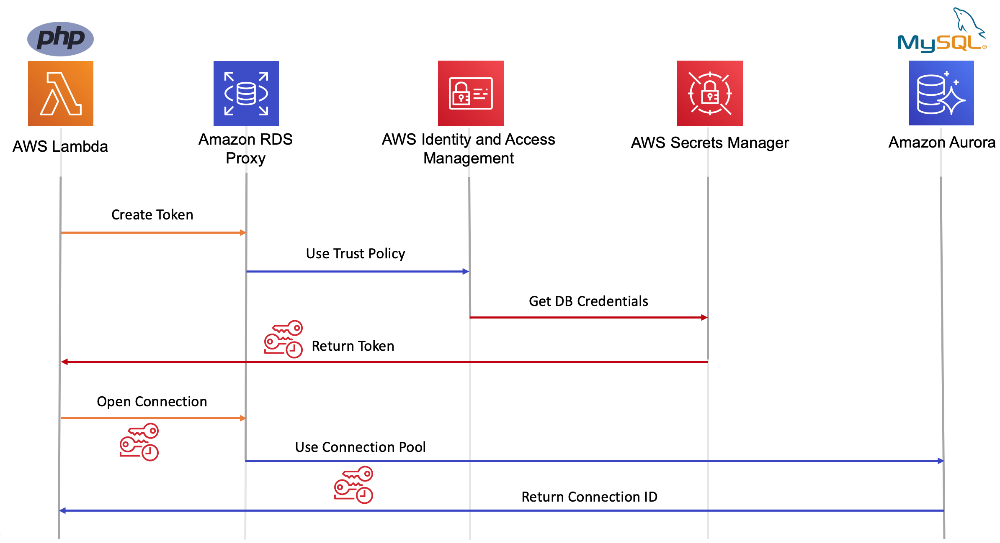

# The Serverless LAMP stack: Relational Databases & Amazon RDS Proxy

The following steps show how to connect to an Amazon Aurora MySQL database held inside a VPC.  The connection is made from a Lambda function running PHP. The Lambda function connects to the database via RDS Proxy. The database credentials that RDS Proxy uses are held in AWS Security Manager and accessed via IAM Authentication. 


## Before you start

Before deploying the Lambda function you must:
- [Create an Amazon RDS Aurora MySQL database](#Create-an-Amazon-RDS-Aurora-MySQL-database)
- [Store the database credentials in AWS Secrets Manager](3)
- [Create an RDS Proxy](#Create-an-RDS-Proxy)

## Deploy the Lambda function
Deploy the application stack using the AWS Serverless Application Model (SAM) CLI:
 
```bash
sam deploy -g
```


## Creating an Amazon RDS Aurora MySQL database

Before you can create an Aurora DB cluster using the AWS CLI, you must fulfil the required prerequisites, such as creating a VPC and an RDS DB subnet group. For more information on how to set this up, locate the subnet group name and VPC security group ids, see DB Cluster Prerequisites.

1. Call the create-db-cluster AWS CLI command to create the Aurora MySQL DB cluster.  

```bash
aws rds create-db-cluster \
--db-cluster-identifier sample-cluster \
--engine aurora-mysql \
--engine-version 5.7.12 \
--master-username admin \
--master-user-password secret99 \
--db-subnet-group-name default-vpc-6cc1cf0a \
--vpc-security-group-ids sg-d7cf52a3 \
--enable-iam-database-authentication true
```

2.	Add a new DB instance to the cluster. 
```bash
aws rds create-db-instance \
--db-instance-class db.r5.large \
--db-instance-identifier sample-instance \
--engine aurora-mysql  \
--db-cluster-identifier sample-cluster
```


3. Store the database credentials as a secret in AWS Secrets Manager
```bash
aws secretsmanager create-secret \
--name MyTestDatabaseSecret \
--description "My test database secret created with the CLI" \
--secret-string '{"username":"admin","password":"secret99","engine":"mysql","host":"<REPLACE-WITH-YOUR-DB-WRITER-ENDPOINT>","port":"3306","dbClusterIdentifier":"<REPLACE-WITH-YOUR-DB-CLUSTER-NAME>"}'
```

Make a note of the resultant ARN, you will need this later.
```bash
 {
    "VersionId": "eb518920-4970-419f-b1c2-1c0b52062117", 
    "Name": "MySampleDatabaseSecret", 
    "ARN": "arn:aws:secretsmanager:eu-west-1:1234567890:secret:MySampleDatabaseSecret-JgEWv1"
}
```

This secret is used by RDS Proxy to maintain a connection pool to the database.  
To access the secret, the RDS Proxy service requires permissions to be explicitly granted. 

4.	Create an IAM policy that provides secretsmanager permissions to the secret.

```bash
aws iam create-policy \
--policy-name my-rds-proxy-sample-policy \
--policy-document '{
  "Version": "2012-10-17",
  "Statement": [
    {
      "Sid": "VisualEditor0",
      "Effect": "Allow",
      "Action": [
        "secretsmanager:GetResourcePolicy",
        "secretsmanager:GetSecretValue",
        "secretsmanager:DescribeSecret",
        "secretsmanager:ListSecretVersionIds"
      ],
      "Resource": [
        "<the-arn-of-the-secret>"
      ]
    },
    {
      "Sid": "VisualEditor1",
      "Effect": "Allow",
      "Action": [
        "secretsmanager:GetRandomPassword",
        "secretsmanager:ListSecrets"
      ],
      "Resource": "*"
    }
  ]
}'
```
Make a note of the resultant policy ARN, you will need this to attach the policy to a new role.

5.	Create an IAM Role that has a trust relationship with the RDS proxy service.  This allows the RDS Proxy service to assume this role to retrieve the database credentials.
```bash
aws iam create-role --role-name my-rds-proxy-sample-role --assume-role-policy-document '{
 "Version": "2012-10-17",
 "Statement": [
  {
   "Sid": "",
   "Effect": "Allow",
   "Principal": {
    "Service": "rds.amazonaws.com"
   },
   "Action": "sts:AssumeRole"
  }
 ]
}'
```

6.	Attach the new policy to the role:
```bash 
aws iam attach-role-policy \
--role-name my-rds-proxy-sample-role \
--policy-arn arn:aws:iam::0123456789:policy/my-rds-proxy-sample-policy
```

## Create an RDS Proxy
1.	Use the AWS CLI to create a new RDS Proxy. Replace the `- -role-arn` and `SecretArn` value to those values created in the steps above.
```bash
aws rds create-db-proxy \
--db-proxy-name sample-db-proxy \
--engine-family MYSQL \
--auth '{
        "AuthScheme": "SECRETS",
        "SecretArn": "arn:aws:secretsmanager:eu-west-1:0123456:secret:exampleAuroraRDSsecret1-DyCOcC",
         "IAMAuth": "REQUIRED"
      }' \
--role-arn arn:aws:iam::0123456:role/my-rds-proxy-sample-role \
--vpc-subnet-ids  subnet-c07efb9a subnet-2bc08b63 subnet-a9007bcf
```
To enforce IAM authentication for users of the RDS Proxy, the `IAMAuth` value is set to **REQUIRED**

2.	Add the database cluster to the proxy with the register-db-proxy-targets command.
```bash
Aws rds register-db-proxy-targets \
--db-proxy-name sample-db-proxy \
--db-cluster-identifiers sample-cluster
```

 

## Issue Reporting

If you have found a bug or if you have a feature request, please report them at this repository issues section.

## License

This project is licensed under the MIT license. See the [LICENSE](../LICENSE) file for more info.
