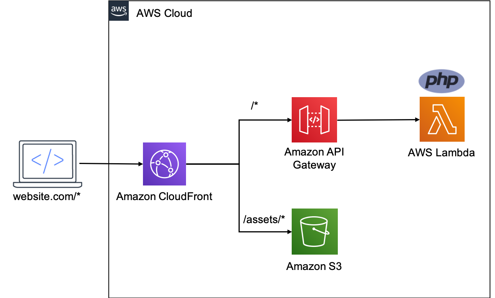
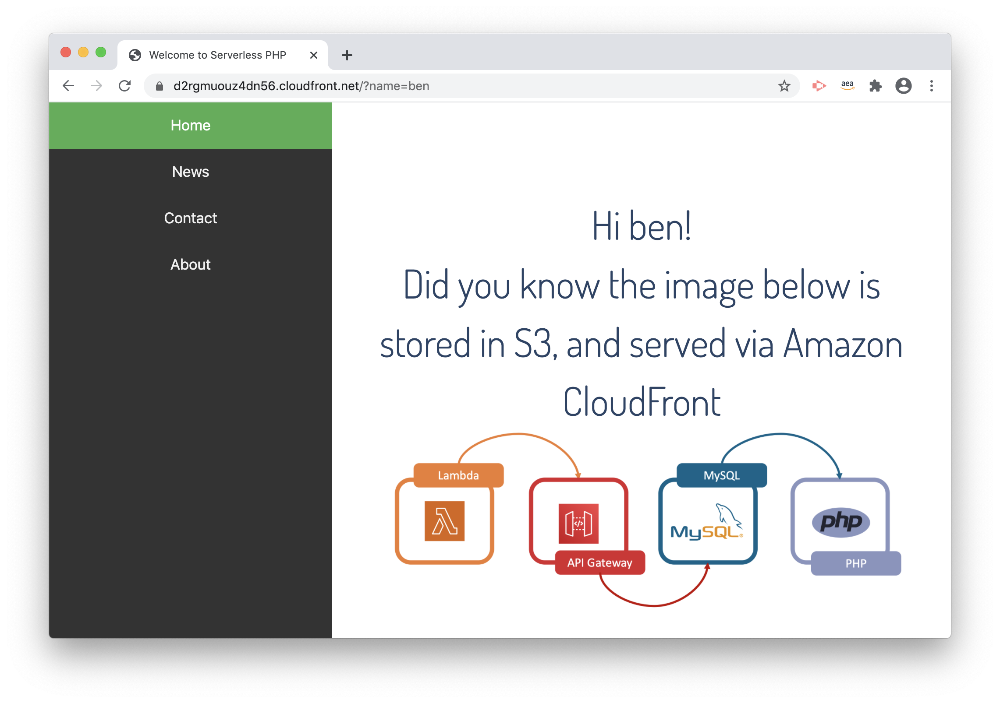

# The Serverless LAMP stack: Replacing the http server

A serverless PHP application without an http web server.

The following steps show how deploy this architecture using the [AWS Serverless Application Model (SAM) CLI](https://aws.amazon.com/serverless/sam/).



This template configures Amazon CloudFront to securely serve and cache static assets from a private Amazon S3 bucket. Dynamic requests are routed downstream to Amazon API Gateway and onto a single AWS Lambda function that holds the applicaion's business logic.

## In this repo

```~~~
0.3-Replacing-The-HTTP-Web-Server-For-Traditional-PHP-Frameworks 
 ┣ assets //dir containing static example files
 ┃ ┣ serverless-lamp-stack.png // example static image 
 ┃ ┗ stylesheet.css //example static stylesheet
 ┣ README.md // this readme~~~~
 ┣ index.php //Lambda function
 ┗ template.yaml //SAM template

```

## Deploying the stack

Clone this repository:

```bash
git clone
```
change to the correct directory:

```bash
cd 0.3-Replacing-The-HTTP-Web-Server-For-Traditional-PHP-Frameworks
```

Install [Bref](https://github.com/brefphp/bref) using Composer:

```bash
composer require bref/bref
```

Deploy the stack: This command uses SAM CLI, but you could also deploy with the [serverless framework](https://www.serverless.com/):

```bash
sam deploy -g
```

## Output

This stack will deploy:

* A CloudFront dristribution with 2 origin domains:
  * **Assets**, This routes any requests to https://domain/assets to an S3 bucket
  * **Website**, This routes all other requests to API gateway
* A private Amazon S3 Bucket
* An AWS API Gateway HTTP API with routes
* A Lambda function with the Bref FPM layer
* An S3 Origin Identity for your CloudFront Distro to access the private S3 bucket.

## Testing

To test that requests for static assets are routed via S3, and dynamic assets are routed via API Gateway -> Lambda:

1. Create a new folder in the S3 bucket named 'assets'
2. Upload the `serverless-lamp-stack.png` and `stylesheet.css` files to the assets folder.
3. In the browser, navigate to the domain generated by [CloudFront](https://aws.amazon.com/cloudfront/)
4. append `?name=value` to the url
   

## Issue Reporting

If you have found a bug or if you have a feature request, please report them at this repository issues section.

## License

This project is licensed under the MIT license. See the [LICENSE](../LICENSE) file for more info.
