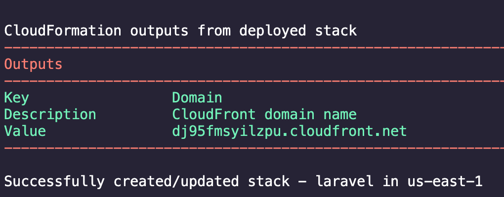

# The Serverless LAMP stack: Building a serverless Laravel app

This blog post explains these step and concepts in detail:
[https://aws.amazon.com/blogs/compute/the-serverless-lamp-stack-part-4-building-a-serverless-laravel-application/](https://aws.amazon.com/blogs/compute/the-serverless-lamp-stack-part-4-building-a-serverless-laravel-application/)

## Deploying Laravel and Bref with AWS SAM

1. Download the Laravel installer using [Composer](https://getcomposer.org/) :
   
   ```
   composer global require Laravel/installer
   ```
2. Install [Laravel](https://laravel.com/):
   
   ```
   composer create-project --prefer-dist laravel/laravel blog
   ```
3. In the Laravel project, install [Bref](https://bref.sh/) using Composer:
   
   ```
   composer require bref/laravel-bridge
   ```
4. Clone the [AWS SAM template](https://github.com/aws-samples/php-examples-for-aws-lambda/blob/master/0.4-Building-A-Serverless-Laravel-App-With-AWS-SAM/template.yaml) in your application’s root directory
   
   ```
   git clone https://github.com/aws-samples/php-examples-for-aws-lambda
   ```
5. Deploy the application using the [AWS SAM CLI](https://docs.aws.amazon.com/serverless-application-model/latest/developerguide/serverless-sam-cli-install.html) guided deploy:
   
   ```
   sam deploy -g
   ```

Once AWS SAM deploys the application, it returns the [Amazon CloudFront](https://aws.amazon.com/cloudfront/) distribution’s domain name. This distribution serves the serverless Laravel application.



## Configuring Laravel for Lambda

Add the following to your Laravel `.env` file:

```bash
SESSION_DRIVER=cookie
LOG_CHANNEL=stderr
VIEW_COMPILED_PATH=/tmp/storage/framework/views
FILESYSTEM_DRIVER=s3
FILESYSTEM_DRIVER_PUBLIC=s3
ASSET_URL=https://{YOUR-CLOUDFRONT-DOMAIN}.cloudfront.net
```

**Compiled views**

Add the following code to the *`Providers/AppServiceProvider.php`* file.

```php
public function boot()
{
   // Make sure the directory for compiled views exist
   if (! is_dir(config('view.compiled'))) {
   mkdir(config('view.compiled'), 0755, true);
   }
}
```

**Public asset files**

Change the configuration in `config/filesystems.php` to the following:

```diff
+ 'public' => env('FILESYSTEM_DRIVER_PUBLIC', 'public_local'),
    'disks' => [
        'local' => [
            'driver' => 'local',
            'root' => storage_path('app'),
        ],
-       'public => [
+       'public_local' => [
            'driver' => 'local',
            'root' => storage_path('app/public'),
            'url' => env('APP_URL').'/storage',
            'visibility' => 'public',
        ],
        's3' => [
            'driver' => 's3',
            'key' => env('AWS_ACCESS_KEY_ID'),
            'secret' => env('AWS_SECRET_ACCESS_KEY'),
            'token' => env('AWS_SESSION_TOKEN'),
            'region' => env('AWS_DEFAULT_REGION'),
            'bucket' => env('AWS_BUCKET'),
            'url' => env('AWS_URL'),
            'endpoint' => env('AWS_ENDPOINT'),
        ],
+  's3_public' => [
+           'driver' => 's3',
+           'key' => env('AWS_ACCESS_KEY_ID'),
+           'secret' => env('AWS_SECRET_ACCESS_KEY'),
+           'token' => env('AWS_SESSION_TOKEN'),
+           'region' => env('AWS_DEFAULT_REGION'),
+           'bucket' => env('AWS_PUBLIC_BUCKET'),
+           'url' => env('AWS_URL'),
+        ],
    ],
```

## Issue Reporting

If you have found a bug or if you have a feature request, please report them at this repository issues section.

## License

This project is licensed under the MIT license. See the [LICENSE](../LICENSE) file for more info.

~~~~

~~~~

