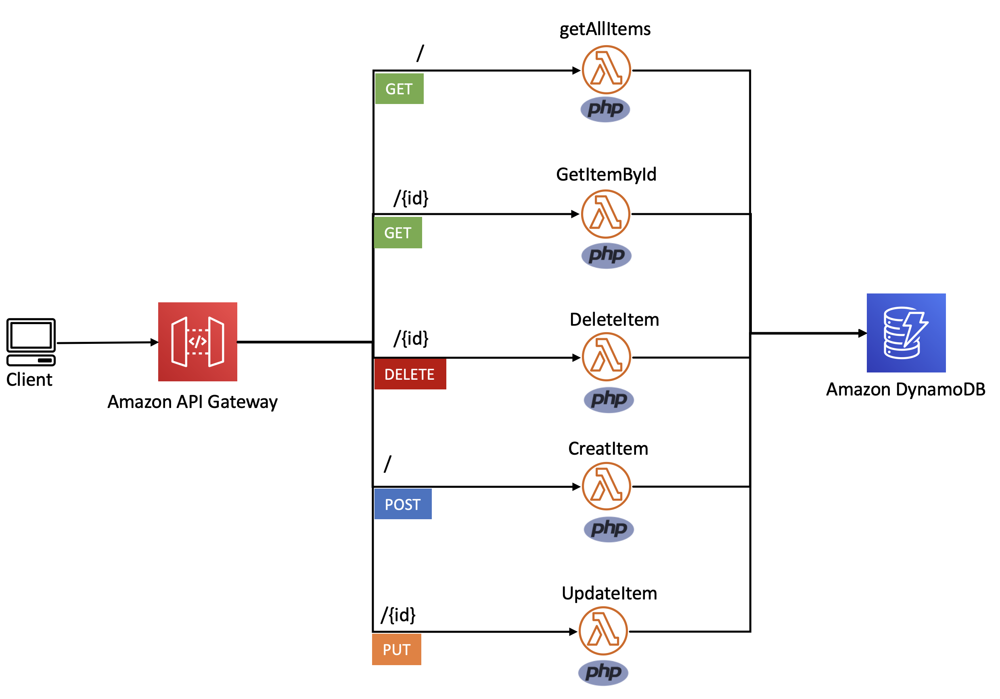

# mvc-php

This project contains source code and supporting files for a serverless application that you can deploy with the AWS Serverless Application Model (AWS SAM) command line interface (CLI). It includes the following files and folders:

- `src` - Code for the application's Lambda function.
- `template.yml` - A template that defines the application's AWS resources.




This application uses an AWS Serverless Application Model (AWS SAM) template to define an HTTP API, 5 Lambda functions, an Amazon DynamoDB table and all the AWS Identity and Access Management (IAM) roles required.  

All routing logic and authentication is managed by Amazon API Gateway. Each Lambda function has limited scope and minimal business logic. It uses a lightweight (non suitable for production) custom-built PHP runtime, explained in this post. Each Lambda function uses the AWS PHP SDK to interact with the DynamoDB table. This architecture is suitable as a serverless microservice for a website backend.

You can update the template to add AWS resources through the same deployment process that updates your application code.

## Deploy the sample application

The AWS SAM CLI is an extension of the AWS CLI that adds functionality for building and testing Lambda applications. It uses Docker to run your functions in an Amazon Linux environment that matches Lambda. It can also emulate your application's build environment and API.

To use the AWS SAM CLI, you need the following tools:

* AWS SAM CLI - [Install the AWS SAM CLI](https://docs.aws.amazon.com/serverless-application-model/latest/developerguide/serverless-sam-cli-install.html).
* Docker - [Install Docker community edition](https://hub.docker.com/search/?type=edition&offering=community).

To  deploy your application for the first time, run the following in your shell:

```bash
sam deploy --guided
```

This command will package and deploy your application to AWS, with a series of prompts:

* **Stack Name**: The name of the stack to deploy to CloudFormation. This should be unique to your account and region, and a good starting point would be something matching your project name.
* **AWS Region**: The AWS region you want to deploy your app to.
* **Confirm changes before deploy**: If set to yes, any change sets will be shown to you before execution for manual review. If set to no, the AWS SAM CLI will automatically deploy application changes.
* **Allow SAM CLI IAM role creation**: Many AWS SAM templates, including this example, create AWS IAM roles required for the AWS Lambda function(s) included to access AWS services. By default, these are scoped down to minimum required permissions. To deploy an AWS CloudFormation stack which creates or modified IAM roles, the `CAPABILITY_IAM` value for `capabilities` must be provided. If permission isn't provided through this prompt, to deploy this example you must explicitly pass `--capabilities CAPABILITY_IAM` to the `sam deploy` command.
* **Save arguments to samconfig.toml**: If set to yes, your choices will be saved to a configuration file inside the project, so that in the future you can just re-run `sam deploy` without parameters to deploy changes to your application.

The API Gateway endpoint API will be displayed in the outputs when the deployment is complete.

## Add a resource to your application
The application template uses AWS SAM to define application resources. AWS SAM is an extension of AWS CloudFormation with a simpler syntax for configuring common serverless application resources, such as functions, triggers, and APIs. For resources that aren't included in the [AWS SAM specification](https://github.com/awslabs/serverless-application-model/blob/master/versions/2016-10-31.md), you can use the standard [AWS CloudFormation resource types](https://docs.aws.amazon.com/AWSCloudFormation/latest/UserGuide/aws-template-resource-type-ref.html).


## Cleanup

To delete the sample application that you created, use the AWS CLI. Assuming you used your project name for the stack name, you can run the following:

```bash
aws cloudformation delete-stack --stack-name mvc-php
```

## Resources

For an introduction to the AWS SAM specification, the AWS SAM CLI, and serverless application concepts, see the [AWS SAM Developer Guide](https://docs.aws.amazon.com/serverless-application-model/latest/developerguide/what-is-sam.html).
Next, you can use the AWS Serverless Application Repository to deploy ready-to-use apps that go beyond Hello World samples and learn how authors developed their applications. For more information, see the [AWS Serverless Application Repository main page](https://aws.amazon.com/serverless/serverlessrepo/) and the [AWS Serverless Application Repository Developer Guide](https://docs.aws.amazon.com/serverlessrepo/latest/devguide/what-is-serverlessrepo.html).
