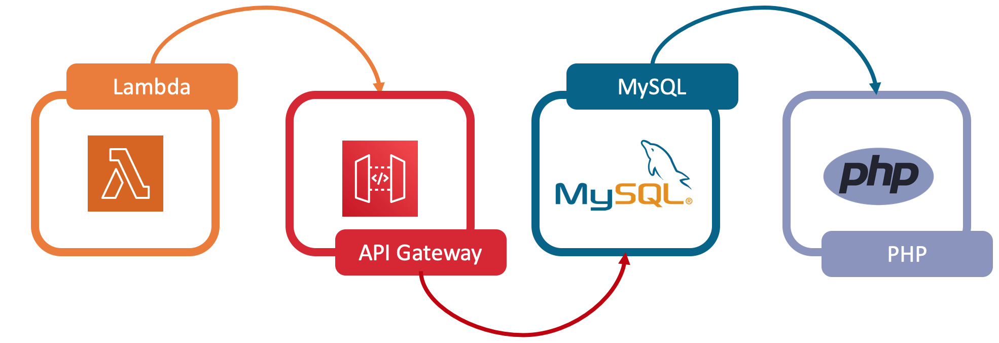

# The Serverless LAMP stack

## Examples

| [0.1-SimplePhpFunction](https://github.com/aws-samples/php-examples-for-aws-lambda/tree/master/0.1-SimplePhpFunction)                                                        | A very simple implementation of a PHP Lambda function. This uses a custom rumtime bootstrap and vendor dependencies as layers.                                    | [Part1](https://aws.amazon.com/blogs/compute/introducing-the-new-serverless-lamp-stack/)                                  |
|------------------------------------------------------------------------------------------------------------------------------------------------------------------------------|-------------------------------------------------------------------------------------------------------------------------------------------------------------------|---------------------------------------------------------------------------------------------------------------------------|
| [0.2-Relational-Database-RDS-Proxy-Example](https://github.com/aws-samples/php-examples-for-aws-lambda/tree/master/0.2-Relational-Database-RDS-Proxy-Example)                | A PHP Lambda function that connects to an Aurora MySQL database using Amazon RDS Proxy.                                                                           | [Part2](https://aws.amazon.com/blogs/compute/the-serverless-lamp-stack-part-3-replacing-the-web-server/)                  |
| [0.3-Replacing-The-HTTP-Web-Server](https://github.com/aws-samples/php-examples-for-aws-lambda/tree/master/0.3-Replacing-The-HTTP-Web-Server-For-Traditional-PHP-Frameworks) | Routing all HTTP requests for static assets directly to S3 and all dynamic requests to a single Lambda function via API Gateway, using Bref's FPM custom runtime. | [Part3](https://aws.amazon.com/blogs/compute/the-serverless-lamp-stack-part-3-replacing-the-web-server/)                  |
| [0.4-Building-A-Serverless-Laravel-App](https://github.com/aws-samples/php-examples-for-aws-lambda/tree/master/0.4-Building-A-Serverless-Laravel-App-With-AWS-SAM )          | Deploy a serverless Laravel application with AWS SAM.                                                                                                             | [Part4](https://aws.amazon.com/blogs/compute/the-serverless-lamp-stack-part-4-building-a-serverless-laravel-application/) |
| [0.5-The CDK construct library for the serverless LAMP stack](https://aws.amazon.com/blogs/compute/introducing-the-cdk-construct-library-for-the-serverless-lamp-stack/)     | Deploy a serverless Laravel application with the AWS CDK.                                                                                                         | [Part5](https://aws.amazon.com/blogs/compute/introducing-the-cdk-construct-library-for-the-serverless-lamp-stack/)        |
| [0.6-From-MVC-To-Microservices](https://github.com/aws-samples/php-examples-for-aws-lambda/tree/master/0.6-MVC-to-microservice)                                              | build serverless PHP applications using microservices.                                                                                                            | [Part6]...                                                                                                                |

## Community Curated PHP Serverless resources

> [serverless-php-resources.md](/serverless-php-resources.md) - A community curated list of PHP / Serverless resources (videos, blogs, code examples frameworks, events).

## Issue Reporting

If you have found a bug or if you have a feature request, please report them at this repository issues section.

## License

This project is licensed under the MIT license. See the [LICENSE](../LICENSE) file for more info.
